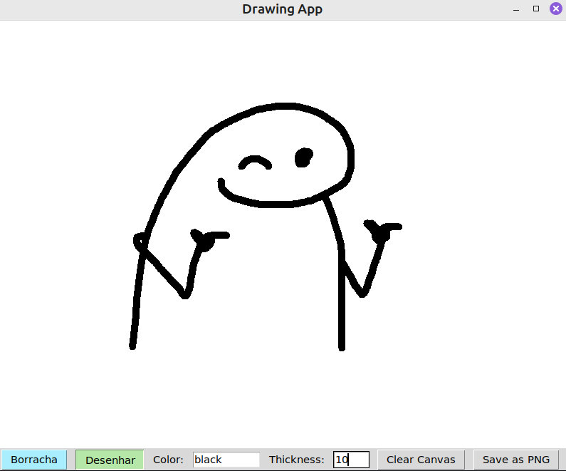

# Proposta de Projeto: Paint Multiplayer

Este projeto propõe o desenvolvimento de um jogo multiplayer simplificado no estilo "Gartic", focado na implementação de uma comunicação de rede robusta e de baixa latência entre dois jogadores. Nosso objetivo é criar uma experiência por turnos onde um jogador desenha e o outro tenta adivinhar o desenho, com a comunicação de estado e as ações do canvas sendo sincronizadas através de um servidor central.

## Fluxo do Jogo

O jogador utiliza o canvas para desenha
- Ferramentad: desenho, borracha, espessura do lápis, escolha da cor, apagar tudo, e salvar png
- Ao finalizar, o jogador salva o desenho

**Palpite:** o adversário recebe o desenho e insere o que acha em um campo de texto, confirmando

**Valida:** aquele que desenhou recebe o palpite e confirma se está certo ou errado

**Pontuação:** quem atingir 3 pontos ganha

## Execução do código
- rodar o `servidor.py`
- rodar o `cliente.py`
- em `cliente.py` descomentar o `app.set_guesser_mode()` e executar novamente

## Infos

- salvar imagem
- lógica para envio de imagens em formato de bytes
- lógica do jogo, em geral

- [Reading and Writing Imgaes and Videos](https://www.opencv.org.cn/opencvdoc/2.3.2/html/modules/highgui/doc/reading_and_writing_images_and_video.html)
- [Image send via TCP](https://stackoverflow.com/questions/20820602/image-send-via-tcp)

No protocolo (em `mensagens.py`), adicionamos mais funções para que suporte dados binários. Adicionamos 3 elementos:
- IMAGE_START_MESSAGE = mostra que os dados serão de uma imagem
- IMAGE_END_MESSAGE = avisa que a transferência da imagem acabou e o protocolo volta a esperar por mensagens de texto
- enviar_bytes() = envio dos dados brutos, usando `conn.sendall()` sem codificar com UTF-8, pois são binários (de PNG)
- receber_bytes() = realiza a leitura dos bytes do HEADER, limpa e depois converte para `int(tamanho_str)`. Imagem pode ser grande, então a leitura dos bytes será feita por blocos.

**Envio e Recebimento de imagem**
1. Início
 - CLiente que está desenhando clica em "Send Image"
 - A thread de envio do Desenhista salva a imagem localmente e a lê em um bloco de bytes (image_bytes).
 - O cliente envia a mensagem de texto !IMAGE_START para o servidor, isso mostra ao serv que a pŕoxima info que chega é uma sequência de bytes, e não um texto, por exemplo

2. Trasmissão dos dados
  - receiving_image = True, e chama receber_bytes()
  - entra num loop para receber todos o bytes do arquivo PNG, mesmo que chegam em diferentes pacotes do tcp 
  - leu tudo, chama retransmitir_imagem()
    - para o cliente que adivinha, envia o !IMAGE_START e os bytes da imagem
  - thread (listen_to_server) do cliente adivinha, recebe a mensagem e começa a obter os dados (receber_bytes())
3. finalizando
- cliente que desenhha envia mensagem !IMAGE_eND ao serv, e ao cliente adv, indica que a transferencia dos bytes está completa, assim, eles voltam a esperar por novas mensagens
- a thread de rede do adv coloca um evento em uma fila (gui_queue)
- a thread da aplicação tk do adv capta o evento, carrega o png para ecibir no acanvas, e o jogo continua...
  